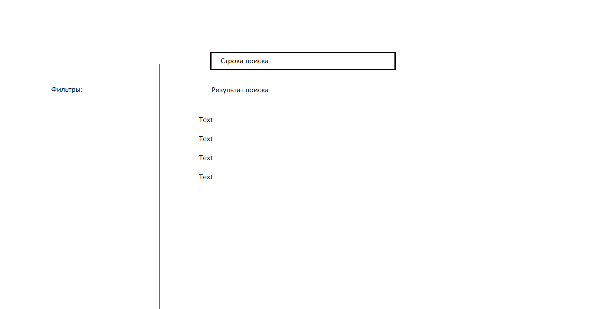

# Учет оборудования поисково-спасательного отряда

Учебный проект Федорова Семена. Поток курса 2022-12.

Позволяет вести учет оборудования поисково-спасательного отряда добровольцев: где (на каком складе), какое оборудование, в каком количестве имеется в данный момент, производить резерв оборудования.
## Визуальная схема фронтенда

1. Маркетинг
   1. [Заинтересанты](./docs/01-marketing/01-stakeholders.md)
   2. [Целевая аудитория](./docs/01-marketing/02-target-audience.md)
   3. [Конкурентный анализ](./docs/01-marketing/03-concurrency.md)
   4. [Анализ экономики](./docs/01-marketing/04-economy.md)
   5. [Пользовательские истории](./docs/01-marketing/05-user-stories.md)
2. DevOps
   1. [Схема инфраструктуры](./docs/02-devops/01-infrastruture.md)
   2. [Схема мониторинга](./docs/02-devops/02-monitoring.md)
3. Тесты
4. Архитектура
   1. [Компонентная схема](./docs/04-architecture/01-arch.md)
   2. [Интеграционная схема](./docs/04-architecture/02-integration.md)
   
## описание MVP
MVP системы позволяет произвести поиск оборудования и зарезервировать оборудование на складе
В рамках MVP прорабатывается одна сущность - оборудование (tool)
